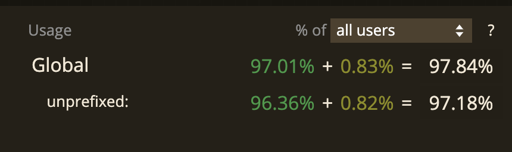

# Header & Footer Sticky on page
Summary of my learning points on how to crerate an header & footer sticky on a page

## Basic

First link tried was: [How to create sticky headers and footers with CSS](https://dev.to/juanbelieni/how-to-create-sticky-headers-and-footers-with-css-2cmi)
It is straight but has some issue:
```html
<div id="container">
  <header>...</header>
  ...
  <footer>...</footer>
</div>
```
```css
header {
  position: sticky;
  top: 0;
}

footer {
  position: sticky;
  bottom: 0;
}
```

The issue is related to the length of the body: when it isn't enough to cover the entire screen, the footer is no more at the bottom of the screen.
- [long body](./naive/index-long-body.html)
- [short body](./naive/index-short-body.html)

Even worst when we have a background image used as full-bleed.
- [long body](./naive_with_fullbleed_background/index-long-body.html)
- [short body](./naive_with_fullbleed_background/index-short-body.html)

Tried also with Firefox 11 and it doesn't work, with the footer disapeared under the bottom of the page.
Given a check on `caniuse`, I've found: [position: sticky](https://caniuse.com/?search=position%3Asticky)
>Baseline: Widely available across major browsers.
>Since September 2019, this feature works across the latest devices and major browser versions (Learn more about Baseline). It **Sticks** to its nearest ancestor that has a scrolling mechanism (created when overflow is hidden, scroll, auto, or overlay), even if that ancestor isn't the nearest actually scrolling ancestor.

Follow several bugs on Firefox, and, for some elements, on Chrome and on Edge.

So it should almost work today on modern browsers on around 97% of the case:


For older browser an alternative of the `position: sticky`, is the use of `position: fixed`. like here: [Sticky Headers and Footers: Enhance User Experience with Fixed Elements](https://medium.com/@stheodorejohn/sticky-headers-and-footers-enhance-user-experience-with-fixed-elements-a728acfbd680)

```html
<header class="sticky-header">
  <h1>My Sticky Header</h1>
</header>

<main>
  <!-- Content goes here -->
</main>

<footer class="sticky-footer">
  <p>&copy; 2023 My Website. All rights reserved.</p>
</footer>
```
```css
.sticky-header {
  position: fixed;
  top: 0;
  width: 100%;
  background-color: #f8f8f8;
  padding: 20px;
  z-index: 999;
}

.sticky-footer {
  position: fixed;
  bottom: 0;
  width: 100%;
  background-color: #f8f8f8;
  padding: 10px;
  z-index: 999;
}
```
It seems almost the same, but actually there are important difference, if we check the documentation of
the two values ([here](https://developer.mozilla.org/en-US/docs/Web/CSS/position)):
- sticky:
>The element is positioned according to the normal flow of the document, and then offset relative to its nearest scrolling ancestor and containing block (nearest block-level ancestor), including table-related elements, based on the values of top, right, bottom, and left. The offset does not affect the position of any other elements.

>This value always creates a new stacking context. Note that a sticky element "sticks" to its nearest ancestor that has a "scrolling mechanism" (created when overflow is hidden, scroll, auto, or overlay), even if that ancestor isn't the nearest actually scrolling ancestor.

- fixed:
>The element is removed from the normal document flow, and no space is created for the element in the page layout. The element is positioned relative to its initial containing block, which is the viewport in the case of visual media. Its final position is determined by the values of top, right, bottom, and left.

>This value always creates a new stacking context. In printed documents, the element is placed in the same position on every page.

So even if the effect seems the same, with the `sticky` value the element is part of the normal flow, in the case of the `fixed`value the element is not part of the normal flow.

## Improved version
A way to fix the issue of short content is using flexbox capability: [Flexbox with fixed header and footer and scrollable content](https://stackoverflow.com/questions/47659664/flexbox-with-fixed-header-and-footer-and-scrollable-content).


```css
body {
    display: flex;
    flex-direction: column;
    height: 100vh;
}
```
In this way we enable column-based flexbox, and force to occupy the entire vertical visible area.

```css
main {
  flex: 1;
  overflow-y: auto;
}
```
Permit the main content to expand if the content is bigger. The `overflow-y: auto` force the vertical scroll of the entire main if oveflow happen vertically. So in this way there is no more the content behind the header / footer.
Also without it, there is a weired behaviour when the scroll arrives at the end of the main content: the header goes upper losting he stikyness.

```css
header {
    position: sticky;
    top: 0;
    flex-shrink: 0;
}

footer {
    position: sticky;
    botton: 0;
    flex-shrink: 0;
}
```
Fix the header and the footer on top and on botton of the screen. The `flex-shrink`instead is used to avoid the resize of header and footer in consequence of changes in the space available in the `main` area.

```html
<body>
  <header>top</header>
  <main>
    <p>1st</p>
    <p>2nd</p>
    <p>3rd<p>
      Lorem ipsum dolor sit amet, consectetur adipiscing elit, sed do eiusmod tempor incididunt ut labore et dolore magna aliqua. Ut enim ad minim veniam, quis nostrud exercitation ullamco laboris nisi ut aliquip ex ea commodo consequat. Duis aute irure dolor in reprehenderit in voluptate velit esse cillum dolore eu fugiat nulla pariatur. Excepteur sint occaecat cupidatat non proident, sunt in culpa qui officia deserunt mollit anim id est laborum.<br>
      Lorem ipsum dolor sit amet, consectetur adipiscing elit, sed do eiusmod tempor incididunt ut labore et dolore magna aliqua. Ut enim ad minim veniam, quis nostrud exercitation ullamco laboris nisi ut aliquip ex ea commodo consequat. Duis aute irure dolor in reprehenderit in voluptate velit esse cillum dolore eu fugiat nulla pariatur. Excepteur sint occaecat cupidatat non proident, sunt in culpa qui officia deserunt mollit anim id est laborum.<br>
      Lorem ipsum dolor sit amet, consectetur adipiscing elit, sed do eiusmod tempor incididunt ut labore et dolore magna aliqua. Ut enim ad minim veniam, quis nostrud exercitation ullamco laboris nisi ut aliquip ex ea commodo consequat. Duis aute irure dolor in reprehenderit in voluptate velit esse cillum dolore eu fugiat nulla pariatur. Excepteur sint occaecat cupidatat non proident, sunt in culpa qui officia deserunt mollit anim id est laborum.<br>
    </p>
    <p>4th</p>
    <p>5th</p>
  </main>
  <footer>bottom</footer>
</body>
```

## UX consideration
from: [Sticky Headers: 5 Ways to Make Them Better](https://www.nngroup.com/articles/sticky-headers/)
- Definition
>Sticky headers (or persistent headers) are a common pattern for keeping the header of a website or app in the same place on the screen while the user scrolls down the page. A version of this pattern is the partially sticky header, which (re)appears at the top of the page as soon as the user starts scrolling up.

1. **Maximize the Content-to-Chrome Ratio by Keeping It Small**
The header occupies space in the page, and because the content is actually the king in the UX of the page, fixing the header can badly impact the space available, so minimize its presence if it has to be sticky.
It's important however to leave header / footer readable and with link or button of reasonable size.
>Based on a study conducted by Parhi, Karlson and Bederson, for users to quickly and accurately select a touch target, its **minimum size should be 1cm × 1cm (0.4in x 0.4in)** ... A past study from the MIT Touch Lab found that the average **person’s fingertips are 1.6–2cm (0.6­­–0.8 in) wide**. The impact area of the typical thumb is even larger — an average of 2.5cm (1 inch) wide! Designing touch targets to account for the physical dimensions of users is basic user-centered design. ... **To avoid accidental taps, targets must first be big enough, and then also spaced well enough**. (Taken from [minimum size touch target](https://www.nngroup.com/articles/touch-target-size/#toc-size-matters-1) the full reference is: Parhi, P., Karlson, A. K., and Bederson, B. B. 2006. “Target size study for one- handed thumb use on small touchscreen devices.” In Proceedings of the 8th Conference on Human-Computer interaction with Mobile Devices and Services. MobileHCI ‘06. DOI= http://doi.acm.org/10.1145/1152215.1152260)

2. **Contrast with Content Is Important**
Because the Header and Footer will be always present it is important to choose a color that clearly separate them from the background in order to avoid confusion to the user. And this is valid also for any expaded submenus attached to header and footer

3. **Keep Motion Minimal, Natural, and Responsive**
Any animation in the page can be distracting and annoying to the user it should be minimal for sticky header. It should be sometime needed to shirnk a big header during scrolling or to partially persist the header, but it should be very smooth otherwise it becomes annoying to user. An animation should be roughly 300–400ms long to preserve the natural feel and not being distracting

4. **Consider Partially Persistent Headers**
Consider to have the header and Footer in two state, easy accessible on every page, but discrete during scrolling.

5. **Consider Whether a Sticky Header Is Needed at All**
Considered the drawback of a sticky hedear and footer, we should alway asses why we need the stickyness and which are the information/functionality to the user that we want to persist.
- Will really needed to a user to have this functionality (a login, a search bar or a navigation menu) accessible in every moment during the reading of a page?
- Will the user continuely using it during the reading of a page?
If the asnwer is no, probably we don't need the stickyness.
